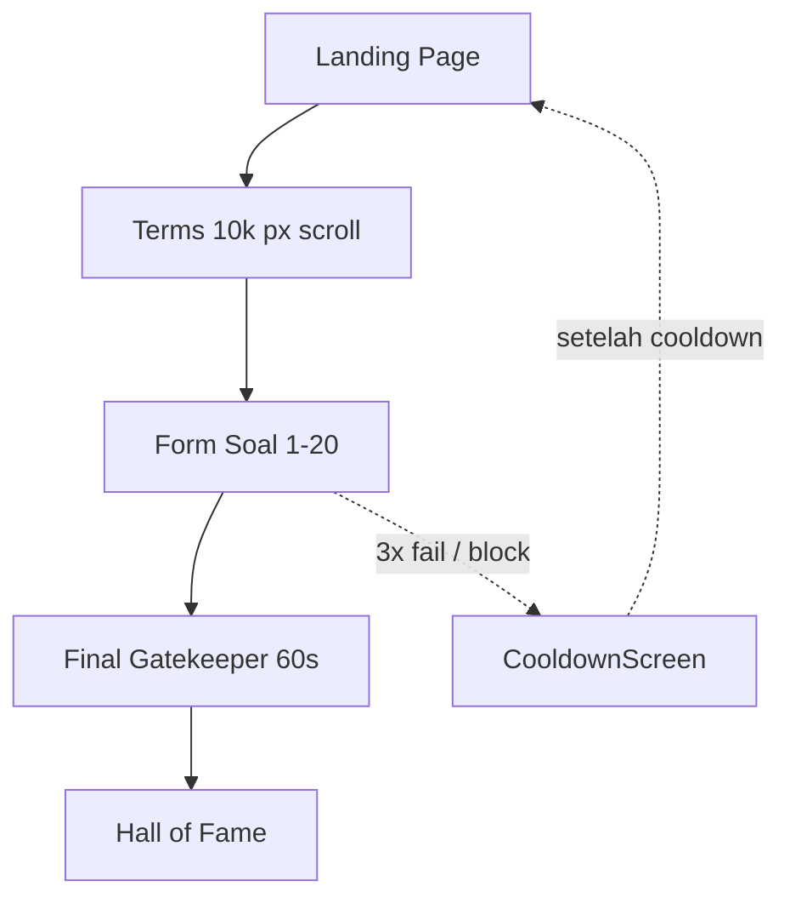

# Rencana Implementasi: Portal Bantuan Eksistensi v13

Berdasarkan [docs/BLUEPRINT-Portal-Bantuan-Eksistensi-v13.md](docs/BLUEPRINT-Portal-Bantuan-Eksistensi-v13.md). Proyek saat ini **kosong** (hanya ada `docs/`); seluruh kode akan dibuat dari nol.

---

## Ringkasan Arsitektur




- **Stack:** Vite + React (JSX), CSS (variables di [src/styles/globals.css](src/styles/globals.css)).
- **State:** Satu context/store (mis. `AppState` di blueprint) untuk step, answers, failCount, isBlocked, loyaltyStrikes, characterClass, formRotation, tcSecretFound, startTime, soundEnabled.
- **Routing:** React Router (Landing, Form flow, Hall of Fame, Cooldown).

---

## Fase 1 — Fondasi (1–2 hari)


| Task                   | Detail                                                                                                                                                                                                  |
| ---------------------- | ------------------------------------------------------------------------------------------------------------------------------------------------------------------------------------------------------- |
| **Setup proyek**       | `npm create vite@latest . -- --template react`, pasang `react-router-dom`. Struktur folder sesuai blueprint: `src/components/`, `src/hooks/`, `src/utils/`, `src/assets/`, `public/`.                   |
| **Landing page**       | Halaman awal dengan vibe “portal pemerintah”: logo parodi, palet biru tua/abu/emas, font serif (heading) + sans (body), watermark *"DOKUMEN SANGAT TIDAK RAHASIA"*, disclaimer no sensitive data.       |
| **Terms & Conditions** | Komponen scroll **10.000px**. Di sekitar pixel ~6.000 sisipkan kalimat tersembunyi: *"Jika Anda membaca kalimat ini, ketik 'SAYA BACA' di field nomor 7."* Simpan flag `tcSecretFound` (cek di soal 7). |
| **Form shell**         | `FormContainer.jsx` + `QuestionRouter.jsx` yang render soal berdasarkan `currentStep`. Progress bar di atas (implementasi chaos di Fase 3).                                                             |
| **State & storage**    | `utils/storage.js`: localStorage untuk blokir (counter + timestamp), cooldown, refresh penalty. Definisi state global (context atau useReducer) sesuai blueprint section 9.                             |


**File kunci:** [src/App.jsx](src/App.jsx), [src/components/LandingPage.jsx](src/components/LandingPage.jsx), [src/components/FormContainer.jsx](src/components/FormContainer.jsx), [src/components/questions/QuestionRouter.jsx](src/components/questions/QuestionRouter.jsx), [src/utils/storage.js](src/utils/storage.js), [src/styles/globals.css](src/styles/globals.css).

---

## Fase 2 — 20 Soal + Validasi Absurd (2–3 hari)


| Soal | Komponen              | Logika utama                                                                       |
| ---- | --------------------- | ---------------------------------------------------------------------------------- |
| 1    | Q01_NamaSamaran       | Tanpa vokal (a/i/u/e/o).                                                           |
| 2    | Q02_TanggalLahir      | Terima MM/DD lalu komplain “kebarat-baratan”; yang lolos DD/MM (tanpa diberitahu). |
| 3    | Q03_JenisKelamin      | Pilih “foto benda” dari galeri absurd (obeng/lipstik/panci).                       |
| 4    | Q04_StatusSosial      | Dropdown: Rakyat Jelata, NPC, Sultan (Maintenance), Error 404.                     |
| 5    | Q05_TingkatKebutuhan  | Slider 0–100; sweet spot 42–69.                                                    |
| 6    | Q06_JumlahTabBrowser  | Harus genap (deteksi via JS / prompt).                                             |
| 7    | Q07_KepuasanNegara    | Skala 1–5; hanya 3 diterima; **wajib** “SAYA BACA” jika tcSecretFound.             |
| 8    | Q08_WarnaLamborghini  | Hanya jawaban “Belum punya” benar.                                                 |
| 9    | Q09_SumberInformasi   | Pilihan: Mimpi, Grup WA Hoax, Bisikan Gaib, Perintah Atasan.                       |
| 10   | RunawayCheckbox       | Checkbox lari saat kursor mendekat; harus diklik.                                  |
| 11   | Q11_UsernameMedsos    | Dilarang `@` dan angka.                                                            |
| 12   | Q12_CitaCita          | Validasi kata kunci (Kaya / Astronot) + pesan absurd.                              |
| 13   | Q13_MenuMakanSiang    | Mie instan / steak/sushi → pesan berbeda.                                          |
| 14   | Q14_PersenKesabaran   | >90% → loading palsu 15s; <10% → pesan.                                            |
| 15   | Q15_NamaGuruSD        | Semua “salah” tapi bisa lanjut.                                                    |
| 16   | Q16_PilihKarakter     | Mage → opacity 0.4; Warrior → bold + caps; simpan ke state.                        |
| 17   | CaptchaEstetik        | Grid 9 gambar; jawaban benar: mie instan.                                          |
| 18   | Q18_Password          | Simbol (Ω/∆/☆), angka, curhatan ≥20 karakter; trigger BSOD saat mulai ketik.       |
| 19   | Q19_ConfirmPassword   | Disable paste; harus ketik ulang.                                                  |
| 20   | Q20_ConfirmTheConfirm | Teks transparan; satu typo → reset ke 19.                                          |


**Roulette (3.7):** Satu soal bonus acak antara posisi 5–18, dari pool di blueprint; komponen terpisah, inject ke `QuestionRouter` berdasarkan session.

**Validasi & gaslighting:** [src/utils/validators.js](src/utils/validators.js) per field; [src/utils/gaslighting.js](src/utils/gaslighting.js) pool pesan error random. Gagal validasi → increment `failCount`; 3x → blokir (storage + CooldownScreen).

---

## Fase 3 — Mekanisme “Gila” (2–3 hari)


| Mekanisme                           | Implementasi                                                                                                                                               |
| ----------------------------------- | ---------------------------------------------------------------------------------------------------------------------------------------------------------- |
| **Anti-Ambis (2.1)**                | Di `storage.js`: counter fail + timestamp; 3 fail → set blockUntil (3×24 jam). CooldownScreen tampilkan pesan + tombol Banding (klik = perpanjang 7 hari). |
| **Denda Refresh (2.2)**             | On beforeunload / visibility: jika dalam masa hukuman, increment refresh penalty (+1 jam).                                                                 |
| **Timer tersembunyi (2.4)**         | `useHiddenTimer.js`: beberapa field (pilih 3–5) harus selesai <10s atau form reset ke step 1; tanpa indikator.                                             |
| **Final Gatekeeper (2.5)**          | `FinalGatekeeper.jsx`: tombol submit aktif hanya setelah kursor diam 60s di atasnya; gerak = reset.                                                        |
| **Mouse Loyalty (3.1)**             | `useMouseLoyalty.js`: mouseout window → popup; 3x → reset form. Counter “Pelanggaran Loyalitas: 1/3” di pojok.                                             |
| **Typing Speed (3.2)**              | `useTypingSpeed.js`: keydown timestamps, rate >5 char/s → lock field 10s + pesan.                                                                          |
| **Progress Bar Chaos (3.3)**        | `ProgressBarChaos.jsx`: kadang mundur 5–10%, stuck 99% 30s, loncat 40%→12% + pesan “Antrean digeser”.                                                      |
| **Sound (3.4)**                     | `useSoundEffects.js` + assets: error = stempel; field OK = mesin tik; submit = paduan suara → jangkrik; cooldown = hold call. Tone.js atau file audio.     |
| **Form Vertigo (3.5)**              | `useFormVertigo.js`: dari soal 15, container `rotate(2deg)`; tiap scroll +0.5° (max 8°).                                                                   |
| **Surveillance (3.6)**              | `SurveillancePopup.jsx`: interval random 30–60s, popup dengan salah satu pesan + loading 3–5s, lalu hilang (React Portal).                                 |
| **Roulette field**                  | Sudah masuk Fase 2; pastikan posisi acak per session.                                                                                                      |
| **T&C neraka**                      | Sudah di Fase 1; validasi “SAYA BACA” di Q7.                                                                                                               |
| **Reverse Psychology Submit (3.9)** | Submit pertama → “Yakin?” → “Yakin yakin?” → “Kami tidak percaya” → reset. Tombol benar: teks kecil “Tidak, saya menyerah”.                                |
| **Fake BSOD (3.10)**                | `FakeBlueScreen.jsx`: di soal 18, overlay biru 5 detik dengan teks GOVERNMENT_PORTAL_EXCEPTION; lalu hilang, form tetap.                                   |


**File kunci:** [src/hooks/useMouseLoyalty.js](src/hooks/useMouseLoyalty.js), [src/hooks/useTypingSpeed.js](src/hooks/useTypingSpeed.js), [src/hooks/useFormVertigo.js](src/hooks/useFormVertigo.js), [src/hooks/useHiddenTimer.js](src/hooks/useHiddenTimer.js), [src/hooks/useSoundEffects.js](src/hooks/useSoundEffects.js), [src/components/ProgressBarChaos.jsx](src/components/ProgressBarChaos.jsx), [src/components/FinalGatekeeper.jsx](src/components/FinalGatekeeper.jsx), [src/components/SurveillancePopup.jsx](src/components/SurveillancePopup.jsx), [src/components/FakeBlueScreen.jsx](src/components/FakeBlueScreen.jsx).

---

## Fase 4 — Ending: Hall of Fame (1 hari)

- **HallOfFame.jsx:** Confetti, suara paduan suara → jangkrik, background emas + watermark “DISETUJUI (MUNGKIN)”.
- **Data:** Username (nama tanpa vokal), Gelar “Aparatur Sipil Imajinasi (ASI)”, NIP 18 digit random, Status Bantuan, Kelas Kesabaran (S/A/B dari waktu).
- **Leaderboard (localStorage):** Top 10 waktu tercepat; Hall of Shame rage-quit; gelar: Speedrunner (<5 menit), Korban Bersertifikat (>30 menit), Pahlawan Kesabaran (first clear).
- **Sertifikat:** Tombol “Unduh Sertifikat” → generate PDF atau gambar (format di blueprint section 6) dengan Nomor Registrasi random, nama, dan teks satire.

**File:** [src/components/HallOfFame.jsx](src/components/HallOfFame.jsx), [src/utils/certificate.js](src/utils/certificate.js) (atau lib PDF) + assets untuk border emas.

---

## Fase 5 — Polish (1 hari)

- Responsive: adaptasi mouse loyalty / hover 60s untuk touch (long-press atau skip di mobile).
- Animasi: stempel “DITOLAK”, transisi step, confetti.
- Nomor registrasi random di pojok tiap halaman.
- Testing alur: blokir 3x, refresh penalty, roulette, T&C secret, reverse submit, BSOD.
- Optional: share/screenshot Hall of Fame.

---

## Urutan Ekspektasi File (Referensi)

```
portal-bantuan-eksistensi/
├── index.html
├── package.json
├── vite.config.js
├── public/favicon.ico
├── src/
│   ├── main.jsx
│   ├── App.jsx
│   ├── styles/globals.css
│   ├── components/
│   │   ├── LandingPage.jsx
│   │   ├── FormContainer.jsx
│   │   ├── RunawayCheckbox.jsx
│   │   ├── CaptchaEstetik.jsx
│   │   ├── FakeBlueScreen.jsx
│   │   ├── SurveillancePopup.jsx
│   │   ├── ProgressBarChaos.jsx
│   │   ├── FinalGatekeeper.jsx
│   │   ├── HallOfFame.jsx
│   │   ├── CooldownScreen.jsx
│   │   └── questions/
│   │       ├── QuestionRouter.jsx
│   │       ├── Q01_NamaSamaran.jsx … Q20_ConfirmTheConfirm.jsx
│   │       └── RouletteQuestion.jsx (optional)
│   ├── hooks/
│   │   ├── useMouseLoyalty.js
│   │   ├── useTypingSpeed.js
│   │   ├── useFormVertigo.js
│   │   ├── useHiddenTimer.js
│   │   └── useSoundEffects.js
│   ├── utils/
│   │   ├── gaslighting.js
│   │   ├── rouletteQuestions.js
│   │   ├── validators.js
│   │   ├── storage.js
│   │   └── certificate.js
│   └── assets/
│       ├── captcha-images/
│       └── sounds/
└── README.md
```

---

## Catatan Penting

- **Aksesibilitas:** Satire only; tidak mengumpulkan data sensitif (no KTP/NIK/foto wajah).
- **Mobile:** Mouse loyalty & hover 60s perlu fallback (long-press / gyro / atau non-blocking di mobile).
- **Persistensi:** localStorage cukup untuk blokir, cooldown, leaderboard; nanti bisa backend (Firebase/Supabase) untuk leaderboard global.
- **Performance:** Sound lazy-load; BSOD dan surveillance pakai React Portal agar tidak mengganggu DOM form.

Estimasi total: **7–10 hari** (solo developer), sesuai milestone di blueprint.